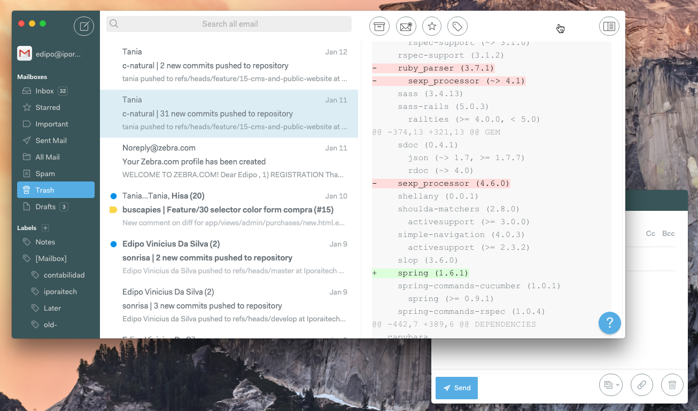
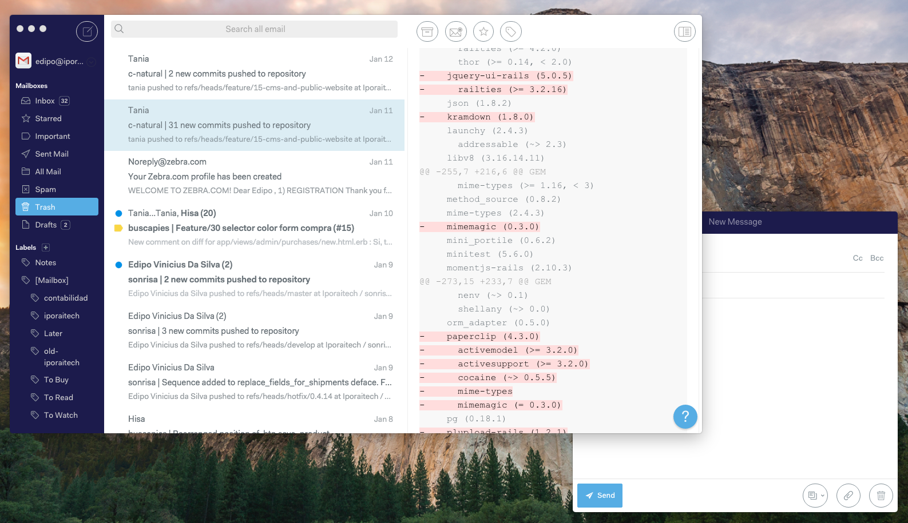
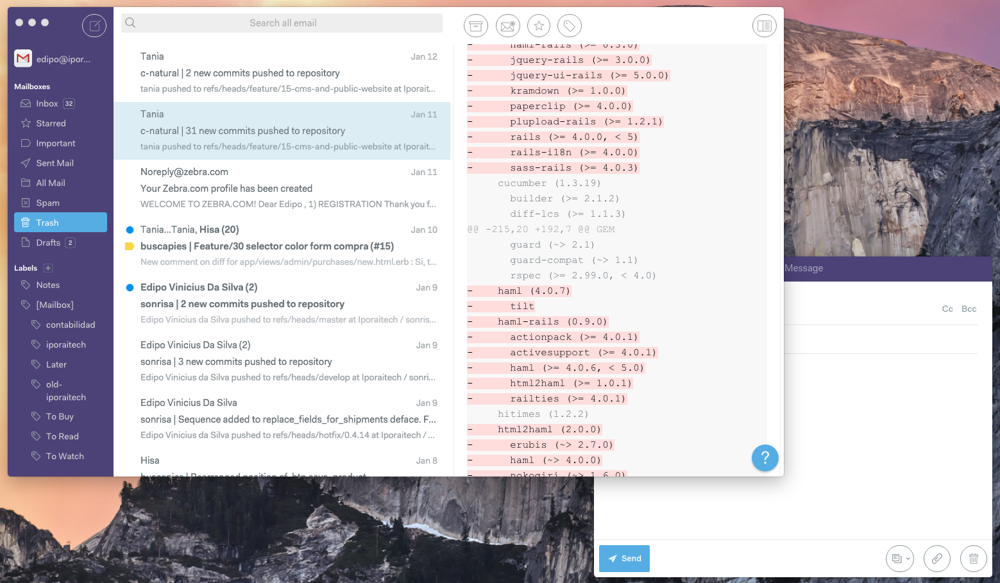
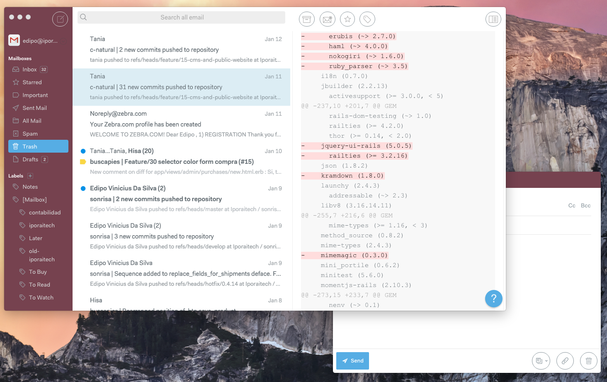

# Ido

Ido is a clean, simple, Polymail-inspired theme for N1

## Why 'Ido'?
Ido in esperanto means descendent/spring and Ido is based on [Taiga](https://github.com/noahbuscher/N1-Taiga)

# If you change the code you can get any sidebar color

Examples:

## Installing

1. [Download](https://nylas.com/n1) Nylas N1 email client if you have not yet
2. [Grab](https://github.com/edipox/n1-ido) the latest release of Ido
3. Open `N1>Preferences>General>Select theme` and select `Install new theme...` from the dropdown

Profit! :money_with_wings:
