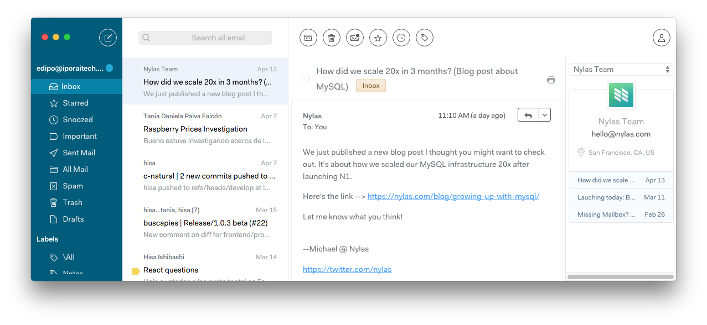
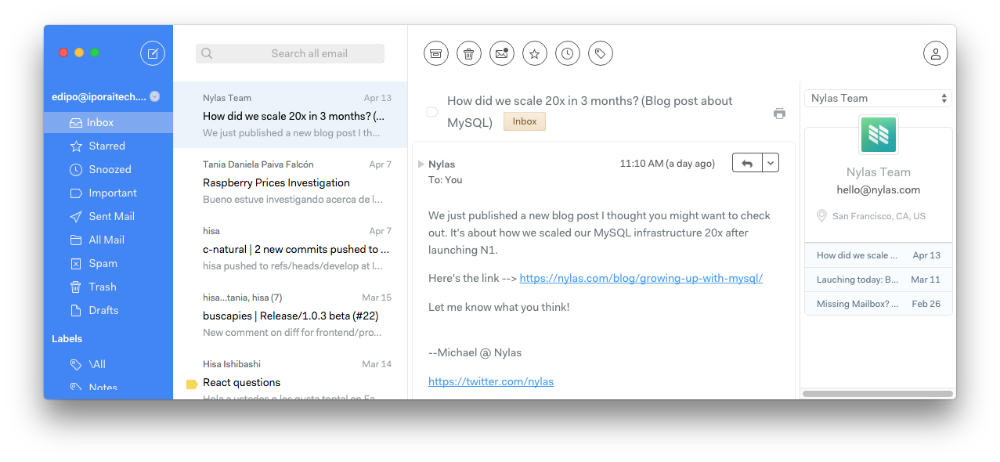
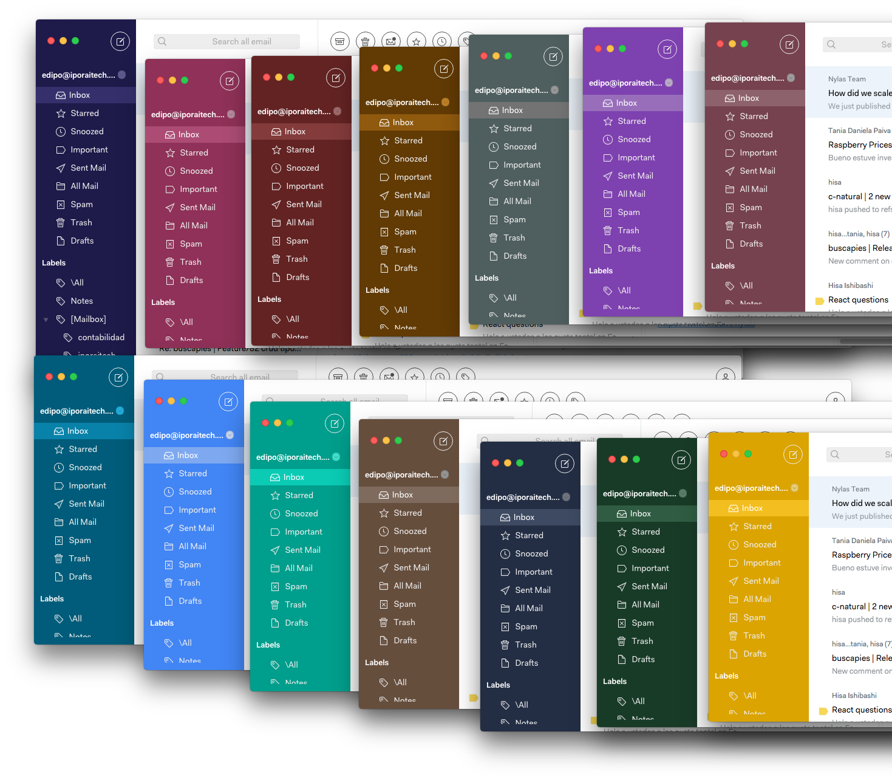

```Now working with Mailspring 1.1.4   ```   :tada:

# Ido

Ido is a clean, simple, Polymail-inspired theme for Mailspring.


## Why 'Ido'?
Ido in esperanto means descendent/spring and Ido is based on [Taiga](https://github.com/noahbuscher/N1-Taiga).

# Theming
The sidebar color can be changed by updating the color value in [this file](https://github.com/edipox/n1-ido/blob/master/styles/variables.less#L32). [Here is a video showing how to do that.](https://youtu.be/4L2v6tuAonE)

## Firebrick
It seems to be a really popular choice


## Freedom
The default theme


## Skyfall
One of my fav :)


## Inbox
Ee.. What?

But if you are looking for an Inbox inspired theme you should definitely try [agapanthus](https://github.com/taniadaniela/n1-agapanthus)

## Polymail
:flushed:


## Examples




## Installing

1. [Download](https://getmailspring.com/) Mailspring - (desktop email client) if you have not yet
2. [Just download the master branch](https://github.com/edipox/n1-ido)
3. Open `Mailspring` -> `Install new theme...`

[Buy me a coffee :coffee::heart:](http://ko-fi.com/A553N9)

## TODO
* Color picker plugin :pray:
